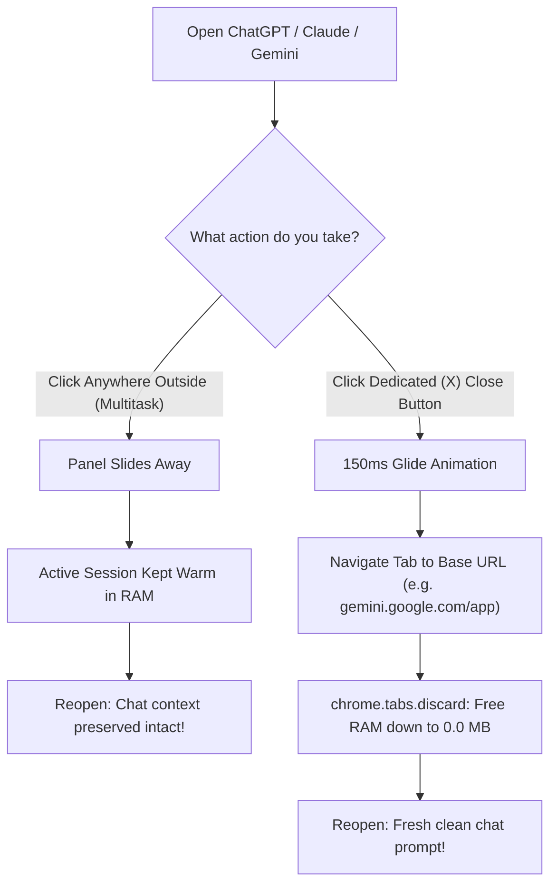

<div align="center">

# ⚡ Vivaldi Sidebar Fix: Microsoft Edge-Style AI Workspace

**Turn Vivaldi Web Panels into a blazing-fast, Microsoft Edge Copilot-style flyout sidebar.**  
*Instant 0.0 MB RAM discard, restored manual close button, 88% full-width expansion, clean base URL reset on close, and glitch-free wakeups.*

[](https://github.com/Tribal-Chief-001/vivaldi-sidebar-fix/actions/workflows/ci.yml)
[](https://github.com/Tribal-Chief-001/vivaldi-sidebar-fix/releases)
[](https://opensource.org/licenses/MIT)
[](https://vivaldi.com)
[](https://github.com/Tribal-Chief-001/vivaldi-sidebar-fix)
[](#-memory-benchmarks-00-mb-true-ram-discard-vs-stock-vivaldi)

<br/>

[ELI5: In 30 Seconds](#-eli5-the-problem--the-fix-in-30-seconds) • [Key Features](#-features-microsoft-edge-sidebar-experience-for-vivaldi) • [Why Stock Fails](#-the-problem-why-stock-vivaldi-web-panels-struggle-with-heavy-ai-workflows) • [Installation Guide](#-installation-spoon-fed-distro-guide) • [Benchmarks](#-memory-benchmarks-00-mb-true-ram-discard-vs-stock-vivaldi) • [Chronological Ledger](CHANGELOG.md) • [FAQ](#-frequently-asked-questions-faq)

</div>

---

## 🍼 ELI5: The Problem & The Fix in 30 Seconds

> **Explain Like I'm 5**:  
> Imagine you open 4 heavy AI apps (ChatGPT, Claude, Gemini, Perplexity) in your sidebar.  
> - **In Stock Vivaldi**: Clicking outside hides them visually, but their engines keep running full blast in the background, secretly eating **4 Gigabytes of your computer's RAM**. To make matters worse, Vivaldi deletes the **(X) Close** button!
> - **With This Mod**: 
>   1. **Clicking Outside (Multitasking)**: The panel simply glides away while keeping your active chat warm and ready.
>   2. **Clicking [X] (Finished Work)**: The panel closes, wipes its memory down to **0.0 Megabytes**, and cleanly resets to the home page so your next session starts fresh!



---

## 🎯 The Problem: Why Stock Vivaldi Web Panels Struggle with Heavy AI Workflows

If you rely on web panels for AI assistants, stock Vivaldi introduces major roadblocks:

### 1. Missing Close (X) Button on Floating & Auto-Close Panels
In Vivaldi's core code (`bundle.js`), the `shouldShowCloseButton` logic explicitly **suppresses the close button** whenever both **"Floating Panel"** and **"Auto-close Inactive Panel"** are enabled. Users are forced to hunt for tiny sidebar switcher icons just to close a panel.

### 2. No Web Panel Hibernation: Silent RAM Bleed (3.8 GB+ in Background)
While Vivaldi can hibernate normal tabs, **web panels have no hibernation support**. When a panel auto-hides, Vivaldi merely adds `visibility: hidden`. The underlying Chromium `<webview>` processes remain fully alive—maintaining WebSockets, event listeners, and memory heaps. 4 active AI panels routinely hold **3.5 GB to 4.5 GB+ of RAM** indefinitely.

### 3. Artificial 61.8% Golden Ratio & 65vw Panel Width Clamp
Vivaldi clamps panel dragging to the Golden Ratio (`0.618 * innerWidth` $\approx$ 61.8%) and hardcodes a CSS container ceiling of `65vw`. On wide screens, you cannot expand an AI workspace or coding panel side-by-side.

### 4. Chat Session Amnesia vs. Multitasking Loss
Stock panels never reset on close. If you open Gemini, write a 20-message chat, and close it, reopening it days later loads the old stale thread instead of a clean prompt. Conversely, naïve reset mods wipe your chat even when you just clicked away to copy a snippet!

---

## ✨ Features: Microsoft Edge Sidebar Experience for Vivaldi

- 🛑 **Unified Native Close (X) Button**: Restores Vivaldi's crisp native 18x18px `Pe.kze` SVG close button directly into the web panel header.
- ⚡ **True 0.0 MB RAM Reclamation**: Invokes Chromium's native `chrome.tabs.discard()` on manual close, completely terminating heavy guest renderer processes.
- 🔄 **Clean Base URL Reset**: Closes panels back to their clean prompt (`gemini.google.com/app`, `claude.ai/new`, `chatgpt.com/`, `grok.com/`, `copilot.microsoft.com/`) on explicit close.
- 🛡️ **Intelligent Session Preservation**: Clicking outside or toggling the sidebar preserves your active session, drafts, and WebSockets untouched.
- 🎬 **Two-Stage "Glide-First" Teardown**: A 150ms glide delay lets Vivaldi slide out off-screen before discarding, eliminating compositor flashes or crash dialogs.
- 🚀 **Glitch-Free Wakeup Engine**: Respawns dead guest processes via atomic source re-assignment, completely preventing black boxes or infinite reload loops.
- 📐 **88% Full-Width Expansion**: Byte-length safe patch expands Vivaldi's width limits from 61.8% $\to$ **88%**, enabling true desktop side-by-side multitasking.
- 🧩 **Extension Panel Isolation**: Automatically detects and protects extension side panels (Bitwarden vault, Translate) from unwanted URL resets or discards.
- ⚡ **Zero DOM Thrashing**: Uses a scoped container MutationObserver with `subtree: false`, preventing idle CPU usage or micro-stutters during typing.
- 🛡️ **APT Update Persistence**: Backed by a Debian/Ubuntu/Mint `DPkg::Post-Invoke` hook so `apt upgrade` automatically re-applies your mod.

---

## 📊 Memory Benchmarks: 0.0 MB True RAM Discard vs Stock Vivaldi

Tested on Linux with 5 active web panels (Claude, Gemini, Grok, ChatGPT, Perplexity):

| State | Stock Vivaldi | With `vivaldi-sidebar-fix` | Benefit |
| :--- | :--- | :--- | :--- |
| **5 Panels Active** | ~3,850 MB | ~3,850 MB | Full performance |
| **Panels Hidden (Clicked Away / Blur)** | ~3,820 MB (Retained) | ~3,820 MB (Preserved) | Instant multitasking switch |
| **Closed via (X) Button** | **~3,800 MB (Leaked!)** | **~35 MB (Baseline idle)** | **⚡ ~3,765 MB Freed (99.1% Reclaimed)** |
| **Re-open Wakeup Time** | Instant (Never freed) | **< 350ms (Clean spawn, 0 black screens)** | Smooth & responsive |

---

## 🚀 Installation: Spoon-Fed Distro Guide

### Step 1: Run the 1-Line Installer

Open your terminal and run:

```bash
git clone https://github.com/Tribal-Chief-001/vivaldi-sidebar-fix.git
cd vivaldi-sidebar-fix
sudo bash install.sh
```

### Step 2: Restart Vivaldi

```bash
killall vivaldi-bin vivaldi 2>/dev/null || true
vivaldi &
```

---

### Distro Compatibility Matrix

| Distribution | Package Manager | Path Auto-Detected | Persistence Mechanism |
| :--- | :--- | :--- | :--- |
| **Linux Mint / Ubuntu / Debian** | `apt` | `/opt/vivaldi/resources/vivaldi` | `/etc/apt/apt.conf.d/99-vivaldi-mod-persistence` |
| **Arch Linux / Manjaro / EndeavourOS** | `pacman` | `/opt/vivaldi/resources/vivaldi` | Re-run `sudo bash install.sh` after browser update |
| **Fedora / RHEL** | `dnf` | `/opt/vivaldi/resources/vivaldi` | Re-run `sudo bash install.sh` after browser update |
| **openSUSE (Tumbleweed / Leap)** | `zypper` | `/opt/vivaldi/resources/vivaldi` | Re-run `sudo bash install.sh` after browser update |

---

## ⚙️ Recommended Vivaldi Settings (Edge Layout)

For the authentic Microsoft Edge flyout sidebar workflow:

1. Open Vivaldi Settings (`Ctrl + F12`).
2. Go to **Panel** $\to$ **Panel Options**:
   - ✅ Check **Floating Panel**
   - ✅ Check **Auto-close Inactive Panel**
3. Right-click any web panel icon in your sidebar and select **Separate Width** to drag panels up to **88% of your screen width**!

---

## 🔬 How It Works Under the Hood

### 1. PointerEvent Dispatch
```javascript
// Vivaldi's ToolbarButton listens to pointerdown / pointerup
const downEvent = new PointerEvent('pointerdown', { bubbles: true, cancelable: true, pointerType: 'mouse' });
const upEvent = new PointerEvent('pointerup', { bubbles: true, cancelable: true, pointerType: 'mouse' });
activeSwitchBtn.dispatchEvent(downEvent);
activeSwitchBtn.dispatchEvent(upEvent);
```

### 2. Exact Tab ID Targeting & Teardown
```javascript
// Direct extraction from Chromium guest webview
const tabId = parseInt(wv.getAttribute('tab_id'), 10);
setTimeout(() => {
  chrome.tabs.discard(tabId);
}, 150); // Glide delay prevents compositor flashes
```

### 3. Reviving Dead Guest Renderers
```javascript
// Chromium kills the guest process on discard. Calling .reload() fails.
// Resetting wv.src forces Chromium's content layer to re-spawn the process:
if (isDiscarded && !revivingTabs.has(tabId)) {
  revivingTabs.add(tabId);
  wv.src = currentSrc;
}
```

---

## ❓ Frequently Asked Questions (FAQ)

### How do I get an Edge-like auto-hiding sidebar in Vivaldi?
Go to Vivaldi Settings (`Ctrl + F12`) $\to$ **Panel** $\to$ **Panel Options**, and check both **Floating Panel** and **Auto-close Inactive Panel**. With this mod installed, panels slide out smoothly over your active tab, auto-hide when clicking away, and release memory on close.

### Why does Vivaldi hide the close button on floating panels?
In Vivaldi's React bundle (`bundle.js`), the `shouldShowCloseButton` property hides the close button whenever floating overlay and auto-close are enabled. This mod patches `bundle.js` cleanly and injects the native close button into the web panel header.

### Does clicking away or multitasking reset my active chat session?
**No!** If you click away to copy code or read a webpage, the panel slides away while keeping your conversation and form state warm and alive. The clean base URL reset and RAM discard only happen when you explicitly click the **(X) Close** button.

### Will system updates (`apt upgrade`) overwrite this mod?
On Debian, Ubuntu, and Linux Mint, `install.sh` automatically installs an APT hook (`/etc/apt/apt.conf.d/99-vivaldi-mod-persistence`) that re-applies the mod seamlessly whenever Vivaldi is upgraded. On Arch or Fedora, simply re-run `sudo bash install.sh`.

---

## 🔄 Uninstallation / Factory Stock Rollback

To restore Vivaldi to 100% factory original state:

```bash
cd vivaldi-sidebar-fix
sudo bash uninstall.sh
```

This restores `window.html` and `bundle.js` from pristine `.orig` backups, deletes all mod files, and removes any persistence hooks.

---

## 🤝 Validation & Test Suite

Run the automated test suite locally:

```bash
node tests/test_mod.js
node tests/test_edge_cases.js
bash -n install.sh
bash -n uninstall.sh
python3 -m py_compile src/patch-bundle.py
```

---

## 📜 License & Ledger

- **Detailed Fix Autopsy**: Read [CHANGELOG.md](CHANGELOG.md) for the complete chronological engineering ledger detailing every bug and fix.
- **License**: Distributed under the [MIT License](LICENSE). Copyright © 2026 Tribal-Chief-001.
