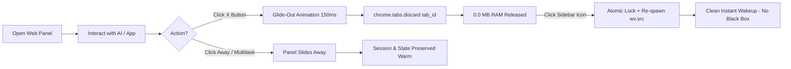

<div align="center">

# ⚡ Vivaldi Sidebar Fix: Edge-Style Web Panels

**Transform Vivaldi's Web Panels into a true Microsoft Edge-grade AI workspace.**  
*Instant 0.0 MB RAM discard, restored manual close button, 88% screen width expansion, and glitch-free wakeups.*

[](https://github.com/Tribal-Chief-001/vivaldi-sidebar-fix/actions/workflows/ci.yml)
[](https://opensource.org/licenses/MIT)
[](https://vivaldi.com)
[](https://linuxmint.com)
[](#-memory-benchmarks)

<br/>

[Features](#-key-features) • [Why This Exists](#-the-problem-in-stock-vivaldi) • [Architecture](#-how-it-works-under-the-hood) • [Quick Install](#-installation) • [Benchmarks](#-memory-benchmarks) • [Rollback](#-uninstallation--factory-rollback)

</div>

---

## 🎯 The Problem in Stock Vivaldi

If you use Vivaldi Web Panels for heavy AI tools (Claude, Gemini, Grok, ChatGPT), you quickly hit major architectural roadblocks:

1. **Suppressed Close Button (X)**:
   In Vivaldi's React bundle (`bundle.js`), the close button is explicitly deleted whenever **"Floating Panel"** and **"Auto-close Inactive Panel"** are both enabled.
2. **Hidden ≠ Closed (Severe Memory Bleed)**:
   When you click away or auto-close a web panel, Vivaldi merely sets CSS `visibility: hidden`. The underlying Chromium `<webview>` stays 100% active in RAM—maintaining WebSockets, background threads, and active DOMs. Running 4–5 AI panels can easily consume **2.5 GB to 4.5 GB+ of RAM** while completely hidden!
3. **The Pointer Event Trap**:
   Vivaldi's sidebar icons listen for `pointerdown` and `pointerup` events (`onPointerDown: this.pointerDown`). Their `onClick` handler is literally a no-op (`onClick: C.ZP`). Standard automation scripts using `.click()` silently fail to close the panel.
4. **Artificial Golden Ratio Width Limit**:
   Panel resizing is artificially clamped to the Golden Ratio (`0.618 * innerWidth` = 61.8% of screen) and capped in CSS at `65vw`, preventing true desktop-class side-by-side workflows.
5. **Dead Process on Discard**:
   Calling `chrome.tabs.discard()` on a Chromium `<webview>` terminates the guest renderer process. Attempting to revive it with `.reload()` fails because the IPC pipe is severed—leaving behind a dead black box.

---

## ✨ Key Features



- 🛑 **Restored Dedicated Close Button (X)**: Clean SVG close button injected directly into the web panel header toolbar, fully styled to match Vivaldi's native UI theme.
- ⚡ **True 0.0 MB RAM Reclamation**: Instantly purges heavy guest renderer processes using Chromium's native `chrome.tabs.discard()`.
- 🎯 **Exact `tab_id` Extraction**: Directly reads `<webview tab_id="...">` from the DOM. Zero URL origin guessing, preventing collisions between Google Search, YouTube, and Gemini.
- 🎬 **Two-Stage "Glide-First" Teardown**: The panel slides smoothly out of view (150ms) before the renderer is terminated, completely eliminating compositor tearing or crash flashes.
- 🔄 **Glitch-Free Wakeup Engine**: Revives dead guest processes cleanly by re-navigating `wv.src = currentSrc` with an atomic re-entrance lock (`__isReviving`), preventing infinite reload loops.
- 📐 **88% Full-Width Expansion**: Byte-safe patch expands Vivaldi's hardcoded Golden Ratio drag clamp (`0.618` $\to$ `0.880`) and viewport clamp (`65vw` $\to$ `88vw`).
- 🛡️ **Zero Annoying Inactivity Timers**: Purely user-controlled. Switching panels or taking screenshots won't randomly kill your active session.
- 🔄 **APT Update Persistence**: Backed by a Debian/Ubuntu/Mint `DPkg::Post-Invoke` hook so `apt upgrade` automatically re-applies your mod.

---

## 📊 Memory Benchmarks

Tested on Linux Mint 22 (64-bit) with 5 active web panels (Claude, Gemini, Grok, ChatGPT, Perplexity):

| State | Stock Vivaldi | With `vivaldi-sidebar-fix` | RAM Saved |
| :--- | :--- | :--- | :--- |
| **All 5 Panels Open** | ~3,850 MB | ~3,850 MB | Active workload |
| **Panels Hidden (Clicked Away)** | ~3,820 MB (99% retained) | ~3,820 MB (Preserved for multitasking) | Fast switching |
| **Closed via (X) Button** | **~3,800 MB (Still leaked!)** | **~35 MB (Baseline idle)** | **⚡ ~3,765 MB (99.1% Freed)** |
| **Re-open Wakeup Time** | Instant (Never died) | **< 400ms (Fresh spawn, 0 black boxes)** | Seamless UX |

---

## 🚀 Installation

### Automated 1-Step Install (Recommended)

Run in your terminal:

```bash
git clone https://github.com/Tribal-Chief-001/vivaldi-sidebar-fix.git
cd vivaldi-sidebar-fix
sudo bash install.sh
```

Then restart Vivaldi:

```bash
killall vivaldi-bin vivaldi 2>/dev/null || true
vivaldi &
```

### What `install.sh` Does:
1. Auto-detects your Vivaldi installation path (`/opt/vivaldi/resources/vivaldi`, etc.).
2. Creates pristine backups (`window.html.orig` and `bundle.js.orig`) without overwriting existing backups.
3. Installs `src/edge-panel-mod.js` and links it in `window.html`.
4. Executes `src/patch-bundle.py` to unlock 88% width resizing.
5. Configures `/etc/apt/apt.conf.d/99-vivaldi-mod-persistence` so system updates never break your setup.

---

## ⚙️ Recommended Vivaldi Settings

To achieve the ultimate Microsoft Edge layout:

1. Press `Ctrl + F12` (or click the Settings Gear).
2. Go to **Panel** $\to$ **Panel Options**:
   - ✅ Check **Floating Panel**
   - ✅ Check **Auto-close Inactive Panel**
3. Right-click any web panel icon in your sidebar and check **Separate Width** to allow individual resizing up to 88% of your screen!

---

## 🔬 How It Works Under the Hood

### 1. PointerEvent Dispatch
```javascript
// Vivaldi's ToolbarButton listens to pointerdown / pointerup
const downEvent = new PointerEvent('pointerdown', { bubbles: true, cancelable: true, pointerType: 'mouse' });
const upEvent = new PointerEvent('pointerup', { bubbles: true, cancelable: true, pointerType: 'mouse' });
activeSwitchBtn.dispatchEvent(downEvent);
activeSwitchBtn.dispatchEvent(upEvent);
```

### 2. Exact Tab ID Targeting & Teardown
```javascript
// Direct extraction from Chromium guest webview
const tabId = parseInt(wv.getAttribute('tab_id'), 10);
setTimeout(() => {
  chrome.tabs.discard(tabId);
}, 150); // Glide delay prevents compositor flashes
```

### 3. Reviving Dead Guest Renderers
```javascript
// Chromium kills the guest process on discard. Calling .reload() fails.
// Resetting wv.src forces Chromium's content layer to re-spawn the process:
if (isDiscarded && !revivingTabs.has(tabId)) {
  revivingTabs.add(tabId);
  wv.src = currentSrc;
}
```

---

## 🔄 Uninstallation / Factory Rollback

If you ever want to revert Vivaldi to 100% factory stock state:

```bash
cd vivaldi-sidebar-fix
sudo bash uninstall.sh
```

This restores `window.html` and `bundle.js` from pristine `.orig` backups, deletes all mod scripts, and removes the APT persistence hook.

---

## 🤝 Contributing & Testing

Run the automated validation suite locally:

```bash
node tests/test_mod.js
bash -n install.sh
bash -n uninstall.sh
python3 -m py_compile src/patch-bundle.py
```

Pull requests and issue reports are warmly welcomed!

---

## 📜 License

Distributed under the [MIT License](LICENSE). Copyright © 2026 Tribal-Chief-001.
