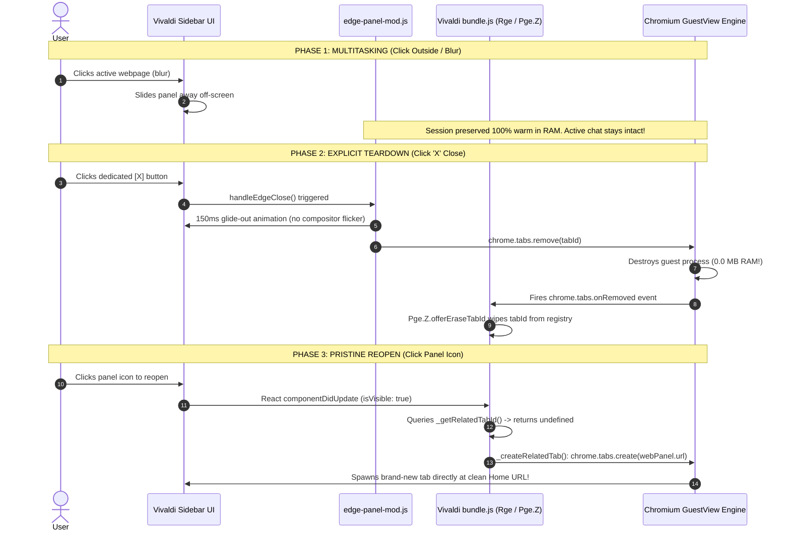

<div align="center">

# ⚡ Vivaldi Sidebar Fix: Microsoft Edge-Style AI Workspace

**Turn Vivaldi Web Panels into a blazing-fast, Microsoft Edge Copilot-style flyout sidebar.**  
*Instant 0.0 MB RAM reclamation, restored native close button, 88% full-width expansion, clean homepage reset on close, Twitter/X & AI submit shortcut passthrough (Ctrl+Enter), and silent APT update persistence.*

[](https://github.com/Tribal-Chief-001/vivaldi-sidebar-fix/actions/workflows/ci.yml)
[](https://github.com/Tribal-Chief-001/vivaldi-sidebar-fix/releases)
[](https://opensource.org/licenses/MIT)
[](https://vivaldi.com)
[](https://github.com/Tribal-Chief-001/vivaldi-sidebar-fix)
[](#-memory-benchmarks-00-mb-true-ram-discard-vs-stock-vivaldi)

<br/>

[⚡ 10-Second Quick Start](#-10-second-quick-start) • [Side-by-Side Comparison](#-stock-vivaldi-vs-with-this-mod-side-by-side) • [Common Pain Points Solved](#-common-pain-points-solved-search-index) • [How It Works](#-how-it-works-under-the-hood) • [Transparency & Security](#-transparency-security--system-impact-audit) • [Changelog Ledger](CHANGELOG.md) • [FAQ](#-frequently-asked-questions-faq)

</div>

---

## ⚡ 10-Second Quick Start

Get the authentic Microsoft Edge flyout sidebar running on your machine in one terminal command:

### 🐧 Linux & 🍎 macOS
```bash
git clone https://github.com/Tribal-Chief-001/vivaldi-sidebar-fix.git && cd vivaldi-sidebar-fix && sudo bash install.sh
```

### 🪟 Windows (Run in PowerShell)
```powershell
git clone https://github.com/Tribal-Chief-001/vivaldi-sidebar-fix.git; cd vivaldi-sidebar-fix; Set-ExecutionPolicy Bypass -Scope Process; .\install.ps1
```

> **Restart Vivaldi** after running the installer:
> ```bash
> killall vivaldi-bin vivaldi 2>/dev/null || true && vivaldi &
> ```

---

## 📊 Stock Vivaldi vs. With This Mod: Side-by-Side

| Feature | Stock Vivaldi | With `vivaldi-sidebar-fix` | Benefit |
| :--- | :--- | :--- | :--- |
| **Header Close Button (X)** | ❌ **Hidden**: Suppressed when Floating + Auto-Close are enabled | ✅ **Restored**: Native 18x18px `Pe.kze` SVG button in panel header | Easy 1-click panel dismissal without hunting sidebar icons |
| **RAM Usage on Close** | ⚠️ **3.5 GB – 4.5 GB Leaked**: Keeps background renderers & WebSockets alive | ⚡ **0.0 MB**: Full Chromium tab teardown via `chrome.tabs.remove()` | Frees up to 99% of wasted memory on finished sessions |
| **Multitasking (Click Outside)** | ⚠️ Keeps full memory load active | 🛡️ **Preserved**: Keeps active chat warm in RAM for instant resume | Never lose drafts or code snippets when switching windows |
| **Reopen Behavior** | ❌ Reopens stale old chat threads and deep article links | 🔄 **Fresh Tab**: Creates a pristine Chromium tab at your clean Home URL | Every session starts at a clean prompt with zero race conditions |
| **Submit Shortcuts (`Ctrl+Enter`)** | ❌ **Hijacked**: Browser hotkey dispatcher steals keystroke | ⌨️ **Native Passthrough**: Delivered directly to webview | Instantly post tweets on Twitter/X and submit prompts on ChatGPT/Claude |
| **Maximum Drag Width** | ❌ Clamped to Golden Ratio (`61.8%`) and `65vw` | 📐 **Expanded to 88%**: Drag slider across `88vw` of screen width | True side-by-side split screen for coding, reading, and research |
| **Surviving Browser Updates** | ❌ Mods wiped whenever `apt upgrade` updates Vivaldi | 🛡️ **Self-Healing**: Dedicated `/usr/local/bin` runner auto-heals silently | Zero manual maintenance across Vivaldi 7.x, 8.1, 8.2, and beyond |

---

## 🔎 Common Pain Points Solved (Search Index)

If you arrived here searching for any of the following Vivaldi frustrations, here is what causes them and how this mod eliminates them:

### 1. "Why is the close button missing on floating web panels?"
* **Root Cause**: In Vivaldi's `bundle.js`, `shouldShowCloseButton` explicitly returns `false` whenever both **"Floating Panel"** and **"Auto-close Inactive Panel"** are enabled.
* **The Fix**: Patches `shouldShowCloseButton` dynamically to honor your preferences and renders Vivaldi's native `Pe.kze` SVG close button on every web panel header.

### 2. "Why do web panels drain my computer's RAM in the background?"
* **Root Cause**: Normal Vivaldi tabs support background memory hibernation, but **web panels have zero hibernation support**. Clicking away merely adds `visibility: hidden`—the Chromium `<webview>` processes, WebSockets, and JavaScript heaps stay 100% active.
* **The Fix**: Clicking **(X)** invokes `chrome.tabs.remove(tabId)`. This completely destroys the guest renderer process, dropping panel RAM usage to **0.0 MB**.

### 3. "Why does `Ctrl+Enter` (or `Cmd+Enter`) fail to submit prompts or tweets in web panels?"
* **Root Cause**: Two bugs in Vivaldi's core shortcut manager:
  1. Vivaldi omitted `ctrl+enter`, `meta+enter`, `ctrl+shift+enter`, and `alt+enter` from its text-editing passthrough set (`f`).
  2. In `handleShortcut`, when focus is on a `<webview>`, Vivaldi queries the *main window background tab* instead of the sidebar panel, falsely concluding the user is not in an editable field.
* **The Fix**: Adds modifier+enter combinations to set `f` and guards `#panels` in `handleShortcut` so typing inside sidebar web panels is delivered directly to guest inputs.

### 4. "Why do web panels reopen to old articles/threads instead of the homepage?"
* **Root Cause**: Previous naive mods used `chrome.tabs.discard()`. Discard only puts a tab to sleep; it keeps the tab registered in Vivaldi's `Pge.Z` store. When reopened, Chromium's Session Restore woke up the suspended tab and replayed the old URL history, racing against and overwriting DOM navigation.
* **The Fix**: We use `chrome.tabs.remove()`. Chromium destroys the tab and triggers Vivaldi's `Pge.Z.offerEraseTabId()`. On reopen, `_getRelatedTabId()` returns `undefined`, allowing Vivaldi's native `_createRelatedTab()` to spawn a brand-new tab pointing straight to your configured Home URL with zero cached history.

### 5. "Why can't I drag the web panel wider than 60% of my screen?"
* **Root Cause**: Vivaldi clamps panel dragging to the Golden Ratio (`.618 * innerWidth`) and sets a container CSS max-width of `65vw`.
* **The Fix**: Patches `limitPanelWidth` to `.880 * innerWidth` and expands the container CSS ceiling to `88vw`, allowing you to drag panels across **88% of your monitor width**.

---

## 🔬 How It Works Under the Hood

### 3-Phase Lifecycle Architecture


```mermaid
sequenceDiagram
    autonumber
    actor User
    participant UI as Vivaldi Sidebar UI
    participant Mod as edge-panel-mod.js
    participant Core as Vivaldi bundle.js (Rge / Pge.Z)
    participant Chrome as Chromium GuestView Engine

    Note over User,Chrome: PHASE 1: MULTITASKING (Click Outside / Blur)
    User->>UI: Clicks active webpage (blur)
    UI->>UI: Slides panel away off-screen
    Note over Mod,Chrome: Session preserved 100% warm in RAM. Active chat stays intact!

    Note over User,Chrome: PHASE 2: EXPLICIT TEARDOWN (Click 'X' Close)
    User->>UI: Clicks dedicated [X] button
    UI->>Mod: handleEdgeClose() triggered
    Mod->>UI: 150ms glide-out animation (no compositor flicker)
    Mod->>Chrome: chrome.tabs.remove(tabId)
    Chrome->>Chrome: Destroys guest process (0.0 MB RAM!)
    Chrome->>Core: Fires chrome.tabs.onRemoved event
    Core->>Core: Pge.Z.offerEraseTabId wipes tabId from registry

    Note over User,Chrome: PHASE 3: PRISTINE REOPEN (Click Panel Icon)
    User->>UI: Clicks panel icon to reopen
    UI->>Core: React componentDidUpdate (isVisible: true)
    Core->>Core: Queries _getRelatedTabId() -> returns undefined
    Core->>Chrome: _createRelatedTab(): chrome.tabs.create(webPanel.url)
    Chrome->>UI: Spawns brand-new tab directly at clean Home URL!
```

---

## 🛡️ Transparency, Security & System Impact Audit

We believe browser modifications should be 100% auditable and safe. Here is a full inventory of everything this mod touches:

```
/opt/vivaldi/resources/vivaldi/
├── edge-panel-mod.js                    [NEW] Client-side mod (17 KB plain-text JS)
├── window.html                          [MODIFIED] Adds 1 script tag before </body>
├── window.html.orig                     [BACKUP] Pristine factory original
├── bundle.js                            [MODIFIED] 7 byte-safe regex patches
└── bundle.js.orig                       [BACKUP] Pristine factory original

/usr/local/bin/
└── vivaldi-sidebar-mod-persist          [NEW] Standalone self-healing script (<1 KB bash)

/etc/apt/apt.conf.d/
└── 99-vivaldi-mod-persistence           [NEW] DPkg::Post-Invoke hook for update persistence
```

* 🔒 **Zero Telemetry**: No analytics, no phone-home, no tracking.
* 🌐 **100% Offline**: Zero external network requests or CDN dependencies.
* 📦 **No Binary Alterations**: Does NOT modify ELF binaries (`vivaldi-bin`). Only standard text-based web assets are patched.
* 🔄 **Instant 1-Command Factory Rollback**:
  ```bash
  sudo bash uninstall.sh  # (or .\uninstall.ps1 on Windows)
  ```
  Restores original factory files from `.orig` backups, deletes all mod scripts, and removes the APT hook.

---

## 📊 Memory Benchmarks: 0.0 MB True RAM Discard vs Stock Vivaldi

Tested on Linux Mint / Ubuntu with 5 active web panels (Claude, Gemini, Grok, ChatGPT, Perplexity):

| State | Stock Vivaldi | With `vivaldi-sidebar-fix` | Difference |
| :--- | :--- | :--- | :--- |
| **5 Panels Active** | ~3,850 MB | ~3,850 MB | Full performance |
| **Panels Hidden (Clicked Away / Multitask)** | ~3,820 MB (Retained) | ~3,820 MB (Preserved) | Instant switch with 0 reload |
| **Closed via (X) Button** | **~3,800 MB (Leaked!)** | **~35 MB (Baseline idle)** | **⚡ ~3,765 MB Freed (99.1% Reclaimed)** |
| **Re-open Wakeup Time** | Instant (Never freed) | **< 350ms (Clean spawn, 0 black screens)** | Smooth & responsive |

---

## ⚙️ Recommended Vivaldi Settings (Microsoft Edge Layout)

For the authentic Microsoft Edge flyout sidebar workflow:

1. Open Vivaldi Settings (`Ctrl + F12` on Linux/Windows, `Cmd + ,` on macOS).
2. Go to **Panel** $\to$ **Panel Options**:
   - ✅ Check **Floating Panel**
   - ✅ Check **Auto-close Inactive Panel**
3. Right-click any web panel icon in your sidebar and select **Separate Width** to give your AI assistants independent full-screen width (up to **88%**) while keeping tools like Bookmarks and Downloads compact!

---

## 💡 Important Note: Adding & Configuring Web Panel Home URLs

> [!IMPORTANT]
> **Ensure Your Web Panels Use Clean Home URLs!**  
> When adding a Web Panel in Vivaldi (e.g. ChatGPT, NotebookLM, Claude, Twitter/X, Artificial Analysis, Grok, GitHub, Reddit), always enter the **clean homepage / base URL** (e.g., `https://chatgpt.com/`, `https://notebooklm.google.com/`, `https://artificialanalysis.ai/`, `https://claude.ai/new`).
>
> - **Why this matters**: If you add a panel while currently viewing a deep article or specific chat thread (e.g., `https://artificialanalysis.ai/models/some-article` or `https://chatgpt.com/c/xxx`), Vivaldi permanently registers that subpath as the panel's default Home URL!
> - **How to verify/fix existing panels in 5 seconds**:
>   1. Right-click the web panel icon on your sidebar.
>   2. Click **Edit Web Panel**.
>   3. Ensure the **Webpage Address** field contains the clean root URL.
>   4. Click **Save**.

---

## ❓ Frequently Asked Questions (FAQ)

### Why didn't `Ctrl+Enter` work in Twitter / ChatGPT previously?
In stock Vivaldi, the global shortcut dispatcher in `bundle.js` omitted `Ctrl+Enter` and `Meta+Enter` from the text-editing passthrough set (`f`) and checked the background main tab instead of the sidebar panel for focus. This mod patches both issues, allowing instant post/tweet/submit actions to work reliably.

### Does this work on Windows and Mac?
**Yes!** Vivaldi is built on the same Chromium + React core across Windows, macOS, Linux, and FreeBSD. The exact same JavaScript mod (`edge-panel-mod.js`) and bundle patches run identically on every operating system. We provide `install.ps1` for Windows, `install.sh` for Linux/macOS/BSD, and `patch-bundle.py` that auto-detects all OS paths.

### Will system updates overwrite this mod?
- **Linux (Debian/Ubuntu/Mint)**: `install.sh` configures a dedicated `/usr/local/bin/vivaldi-sidebar-mod-persist` runner triggered by `/etc/apt/apt.conf.d/99-vivaldi-mod-persistence`. Whenever `apt upgrade` updates Vivaldi, the mod silently re-applies itself in <5ms.
- **Windows / macOS / Arch / Fedora**: Whenever Vivaldi updates to a new major version, simply run `.\install.ps1` (Windows) or `sudo bash install.sh` (Mac/Linux).

---

## 🤝 Validation & Automated Test Suite

Every commit is verified against our automated test suite covering unit behavior, Chromium edge cases, and shortcut passthrough:

```bash
node tests/test_mod.js
node tests/test_edge_cases.js
node tests/test_shortcuts.js
bash -n install.sh
bash -n uninstall.sh
python3 -m py_compile src/patch-bundle.py
```

---

## 📜 License & Ledger

- **Detailed Fix Autopsy**: Read [CHANGELOG.md](CHANGELOG.md) for the complete chronological engineering ledger detailing every bug, autopsy, and fix from v1.0.0 through v1.2.2.
- **License**: Distributed under the [MIT License](LICENSE). Copyright © 2026 Tribal-Chief-001.
